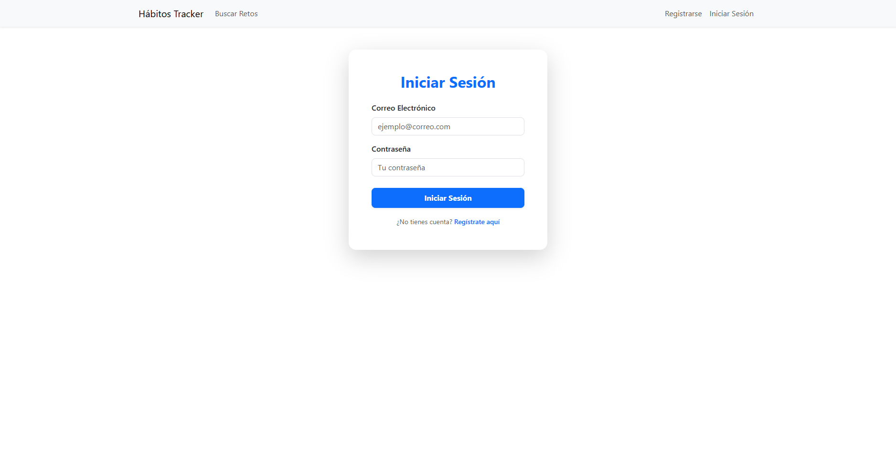
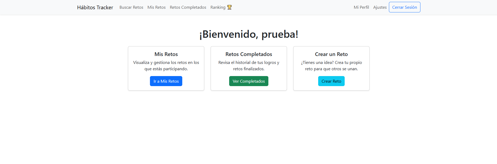
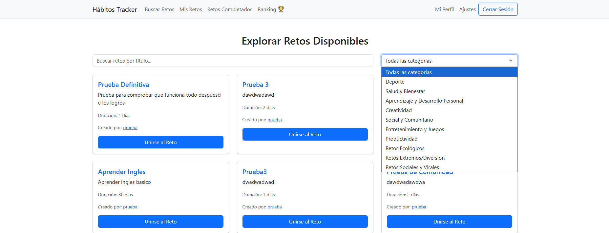
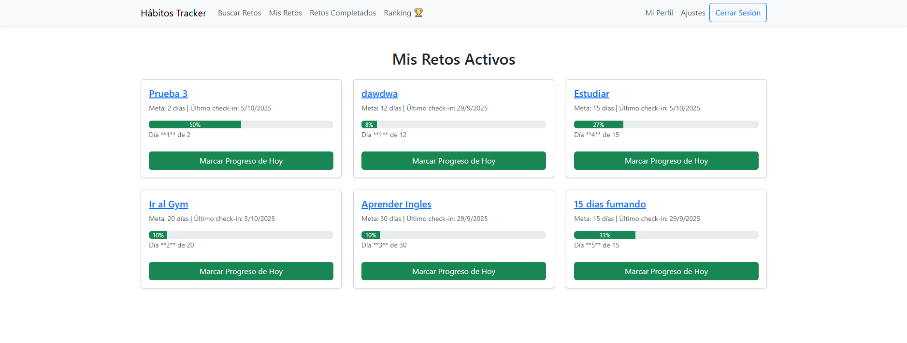
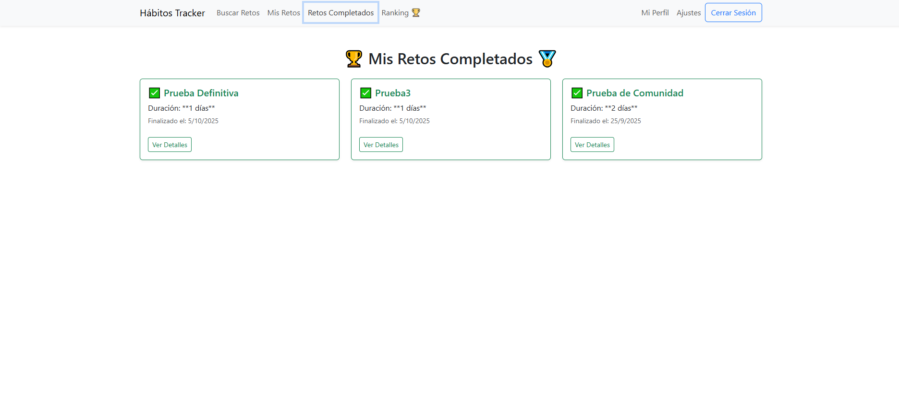
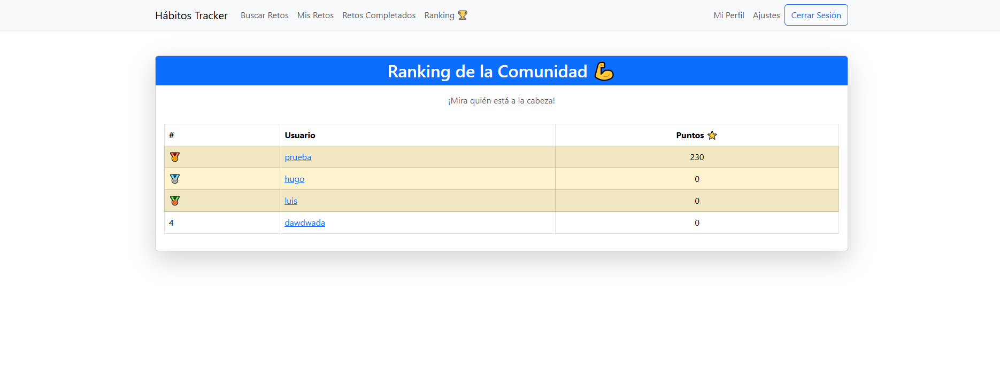
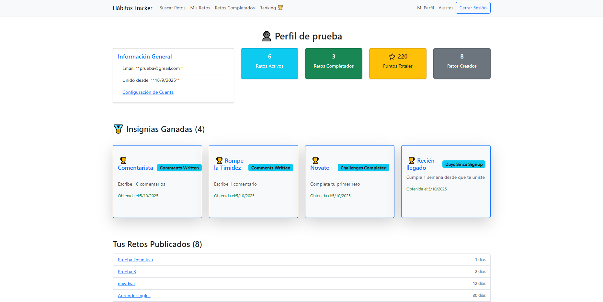
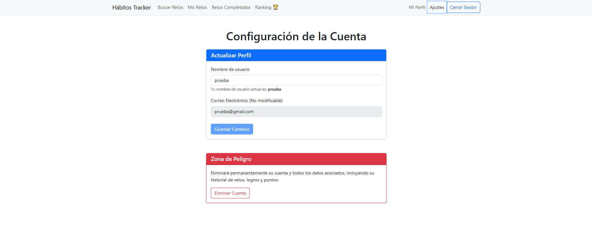

# Habit Tracker: Aplicación Full-Stack de Retos y Logros (PERN Stack)

Una plataforma interactiva que permite a los usuarios crear, seguir y completar desafíos personales (hábitos, metas de aprendizaje, etc.). Incorpora un robusto sistema de logros y un flujo de autenticación completo.

## Tecnologías Utilizadas

Este proyecto fue construido utilizando el stack **PERN** (PostgreSQL, Express, React, Node.js).

### Frontend
* **React (Functional Components & Hooks):** Desarrollo de la interfaz de usuario moderna y reactiva.
* **React Router DOM:** Manejo de la navegación y rutas protegidas.
* **React-Bootstrap:** Implementación de un diseño profesional, responsivo y accesible.
* **Axios:** Cliente HTTP para la comunicación con la API.
* **Context API:** Gestión del estado global de la aplicación (Autenticación, Usuario, Retos).

### Backend & Base de Datos
* **Node.js / Express:** Framework para construir la API RESTful.
* **PostgreSQL:** Base de datos relacional elegida por su **integridad transaccional (ACID)** y fiabilidad de datos.
* **Sequelize (ORM):** Manejo eficiente de las consultas y modelado de datos relacionales en Node.js.
* **JSON Web Tokens (JWT):** Implementación de un sistema de autenticación seguro basado en tokens.

### Características y Funcionalidades Principales
* **Autenticación Completa y Rutas Protegidas:** Implementación de Login, Registro y Logout. Uso de *middleware* JWT para proteger todas las rutas sensibles del *backend*.
* **Gestión de Estado Global:** Uso de **React Context API** para manejar el estado de autenticación (`user`) y los datos del usuario (`userChallenges`), asegurando un flujo de datos limpio entre componentes.
* **CRUD de Retos (Hábitos):** Los usuarios pueden crear, leer y actualizar  sus propios retos.
* **Sistema de Logros/Insignias (Lógica de Negocio):** Implementación de lógica condicional en el *backend* para otorgar insignias automáticamente (ej: "Crear 5 Retos", "Completar 10 Tareas"). *Esto demuestra manejo de lógica de negocio compleja y persistencia de datos relacionales.*
* **Diseño Responsivo:** Interfaz optimizada para dispositivos móviles y de escritorio gracias a React-Bootstrap.

### Vista grafica del Proyecto

